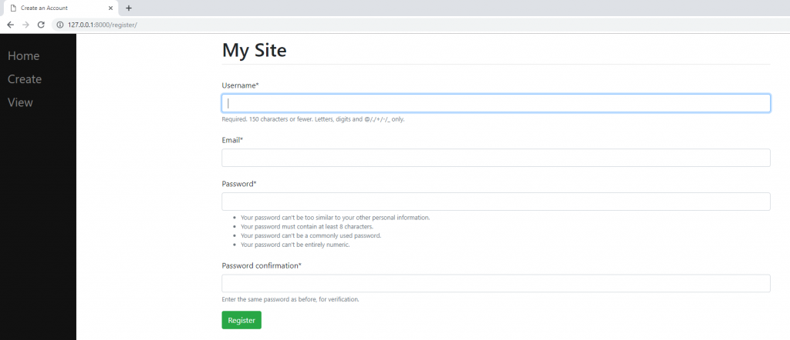

# User-registration-with-Django

## AIM
Create User registration using django

# ALGORITHM
### STEP 1
create a django project django-admin startproject <project_name>
### STEP 2
Use Django framework to create functions
### STEP 3
Create a template for reistration form register.html
### STEP 4
Execute the program

# CODE
settings.py
~~~
INSTALLED_APPS = [
    'django.contrib.admin',
    'django.contrib.auth',
    'django.contrib.contenttypes',
    'django.contrib.sessions',
    'django.contrib.messages',
    'django.contrib.staticfiles',
    "crispy_forms",
    'main.apps.MainConfig',
    'register.apps.RegisterConfig', # <--- add this
]
~~~
forms.py
~~~
from django import forms
from django.contrib.auth.forms import UserCreationForm
from django.contrib.auth.models import User

class RegisterForm(UserCreationForm):
    email = forms.EmailField()

    class Meta:
	model = User
	fields = ["username", "email", "password1", "password2"]
~~~
register.html
~~~


Create an Account



    <form method="POST" class="form-group">
	
	{{ form|crispy }}
	<button type="submit" class="btn btn-success">Register</button>
    </form>

~~~
views.py
~~~
from django.shortcuts import render, redirect
from .forms import RegisterForm

def register(response):
    if response.method == "POST":
	form = RegisterForm(response.POST)
	if form.is_valid():
	    form.save()

	return redirect("/home")
    else:
	form = RegisterForm()

    return render(response, "register/register.html", {"form":form})
~~~
urls.py
~~~
from django.contrib import admin
from django.urls import path, include
from register import views as v

urlpatterns = [
    path('admin/', admin.site.urls),
    path("register/", v.register, name="register"),  # <-- added
    path('', include("main.urls")),
]
~~~
# OUPUT

# RESULT
User registration using django was successfully executed